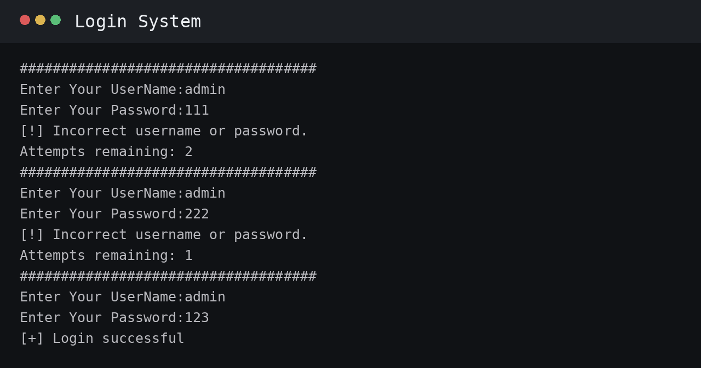
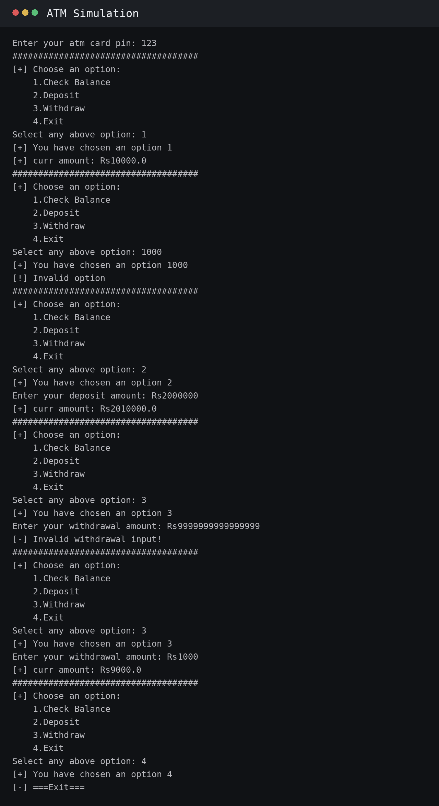
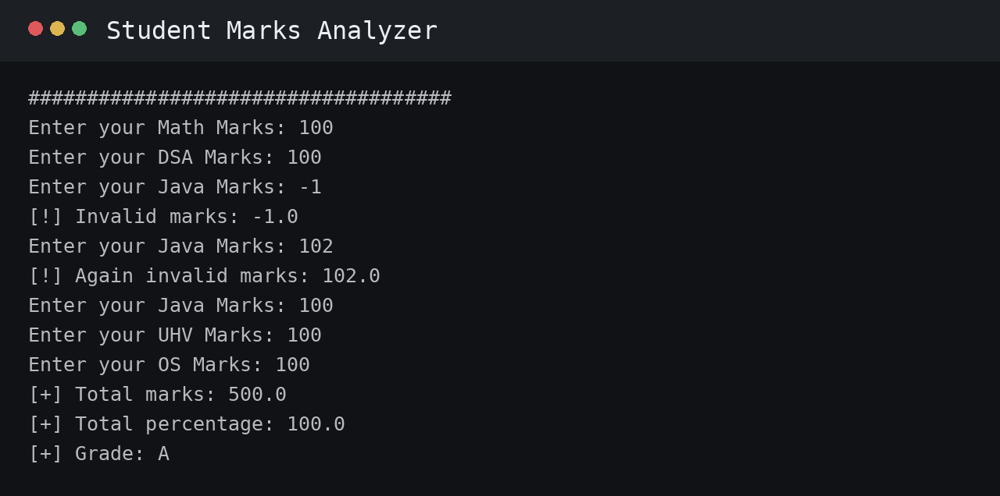
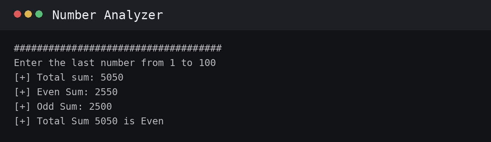
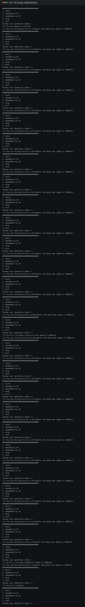

# UpEducative Python Internship

A collection of Python assignments completed during the **UpEducative Internship**.

## Assignments

| # | Assignment | File |
|---|---|---|
| 1 | Login System | [`login-system.py`](login-system.py) |
| 2 | ATM Simulation | [`atm-simulation.py`](atm-simulation.py) |
| 3 | Student Marks Analyzer | [`student-marks-analyzer.py`](student-marks-analyzer.py) |
| 4 | Number Analyzer | [`number-analyzer.py`](number-analyzer.py) |
| 5 | Car Driving Simulation | [`car-driving-simulation.py`](car-driving-simulation.py) |

## 1. Login System

A basic Python login system that stores credentials, allows multiple attempts, and reports successful or failed authentication.

**Key concepts:** functions, loops, conditionals, string input, attempt tracking, exception handling.

### Input / Output

---

## 2. ATM Simulation

A menu-driven ATM simulation starting with a balance of Rs10000. It includes balance checking, deposits, withdrawals, input validation, and an exit option.

**Key concepts:** functions, loops, conditionals, arithmetic assignment operators, user input, exception handling.

### Input / Output

---

## 3. Student Marks Analyzer

A marks analysis program that collects marks for five subjects and calculates total marks, percentage, and grade.

**Subjects:** Math, DSA, Java, UHV, OS.

**Key concepts:** lists, `for` loops, `sum()`-style calculation logic, conditionals, percentage calculation, grade classification, exception handling.

### Input / Output

---

## 4. Number Analyzer

A program that generates numbers from 1 to `n`, separates even and odd numbers, calculates their sums, calculates the total sum, and checks whether the total sum is even or odd.

**Key concepts:** `for` loops, modulo operator, conditional statements, accumulation with `+=`, integer input, exception handling.

### Input / Output

---

## 5. Car Driving Simulation

An object-oriented car simulation with operations for starting, speeding up, slowing down, stopping, and exiting. The car uses a maximum speed and changes speed in increments of 10 km/hr.

**Key concepts:** classes, objects, methods, attributes, boolean state, loops, conditionals, `+=` / `-=`, exception handling.

### Input / Output

---

## Technologies

- **Python 3**
- Google Colab
- Git / GitHub

## Author

**Aditya Raj**

## Internship

**UpEducative Python Internship**
